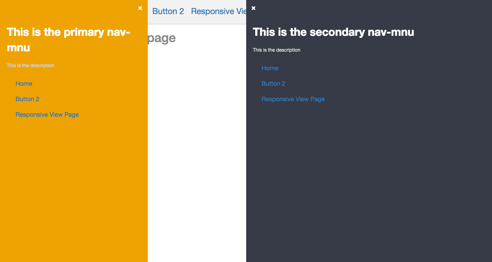

# React Hero (v2.0.0)
### React Hero 2.0.0 temporarily uses a simple HTML textarea instead of the <b>MarkdownEditor</b> component from the package 'react-markdown-editor'. This is because the package doesn't support React 16. While the textarea works, it's not functional as a MD editor. If you need a real MarkdownEditor in your app, please don't upgrade it to RH 2.0.0 yet.

Plugin provides utility directives and services.

## Installation

1. `npm Install`
2. `typings Install`
3. `npm run start:dev`
4. Installing new typings, eg. `typings install dt~react-dom --global --save`

## Releasing a new Version

After you have merged everything to the master branch, follow the following steps to release a new version.

1. Uglify all script files
2. Add all uglified files to the repository `$ git add .` and commit them `$ git commit`
3. Use bump task to release a new version passing required arguments

## Running Test Cases

    jest --no-cache --coverage

## Detailed Documentation

### 1. ResponsiveView :

  - Used to render device specific Views.
  - Create a Component by extending `ResponsiveView<P, S>` and implement device specific render methods.
  `renderDefault` needs to be implemented if not any other render methods.
  Example:
    ```
    class TestView extends ResponsiveView<ITestViewProps, ITestViewState> {

      renderDefault() {
        return <div></div>
      }
      renderMobile() {
        return <div></div>
      }
      renderMobilePortrait() {
        return <div></div>
      }
      renderTablet() {
        return <div></div>
      }
    }
    ```
- If any render method is not overridden in the implementing app for a particular device type with a specific orientation, then `renderDefault` will be executed.

### 2. HeaderFooterLayout :

- Provides the basic skeleton of a HeaderFooterLayout with some basic styles.

- Usage:
  ```
  render() {
    return (
      <HeaderFooterLayout>
        <HeaderView style={optionalStyle} navIconStyle={optionalNavIconStyle}></HeaderView>
        <ContentView style={optionalStyle}></ContentView>
        <FooterView style={optionalStyle}></FooterView>
        <PrimarySliderNav style={optionalStyle}></PrimarySliderNav>
        <SecondarySliderNav style={optionalStyle}></SecondarySliderNav>
      </HeaderFooterLayout>
      )
  }
  ```
- There are also a few custom Widgets that have been provided for use in the `HeaderFooterLayout` which provide predefined styles.
eg:
  - `Title`
  - `Description`
  - `Content`
  - `ButtonList`
  - `ButtonListItem`

- __HeaderView__
    * Takes two optional props: `style` and `navIconStyle` to apply any user specified styles to the header and navIcon respectively
- __FooterView__
    * Uses an optional prop `isSticky` to make the footer stick to bottom of the window. Default value is `false`.
- __Navigation Menu__
    * The `HeaderFooterLayout` has the ability to render upto two navigation menu. `PrimarySliderNav` renders a navigation drawer that opens from left and `SecondarySliderNav` renders a navigation drawer that opens from right. An optional style prop can be passed for customizing the navigation drawer.<br/>
    Example:

        ```
        <HeaderFooterLayout>
            ...
            <PrimarySliderNav>    // The primary navigation menu.
                <div>Primary Navigation ...<div>
            </PrimarySliderNav>
            <SecondarySliderNav>    // The secondary navigation menu.
                <div>Secondary Navigation ...<div>
            </SecondarySliderNav>
        </HeaderFooterLayout>
        ```
    * The style of each navigation menu can be changed via the `style` prop. The example of the same can be found below.

- `PrimarySliderNav` and `SecondarySliderNav` accepts an optional `style` prop to override the default styles:
  ```
const primaryNavStyle: CSS = {
          padding: 'none',
          width: '30%',
          backgroundColor: '#eea303',
      };
 const secondaryNavStyle: CSS = {
          padding: 'none',
          width: '50%',
      };

  render() {
	   return (
        <HeaderFooterLayout>
            ...
            <PrimarySliderNav style={primaryNavStyle}>    // The primary navigation menu.
                <div>A navigation menu<div>
            </PrimarySliderNav>
            <SecondarySliderNav style={secondaryNavStyle}>    // The secondary navigation menu.
                <div>Another navigation menu<div>
            </SecondarySliderNav>
        </HeaderFooterLayout>
	    )
  }
  ```
  


### 3 Themeable Layout

- Themeable layout is used in the scenarios when we want to use the same functionality of an app with the different theme/layouts.
- Prerequisites:

    - A default app directrory: `src/default/yourComponentPath`
    - A themed app directory: `src/yourThemeName/yourComponentPath`
    - The theme name should be present in the redux store before the app is rendered. The structure of the store should be:

       ```
       state: {
	          theme: yourThemeName
       }
       ```
- The function `getThemedComponent` accepts two parameters:

    -  `componentPath` : The path of the component from your theme directory.
    -  `componentName` : The component name to be rendered. A component file can have multiple exported modules. Therefore, this parameter is needed

 - Usage:

   ```
   const ThemedComponent = getThemedComponent('Test/HomePage', 'HomePage')

   render(
       <Router history={hashHistory}>
           <Route path="/" component={ThemedComponent}/>
       </Router>
   );
   ```

- If the theme name or the `ThemedComponent` is not found, the component from the `default` directory will get rendered.

### 4 HTTP requests

- Before using this feature the following configuration should be present in the  package.json:

    ```
    "reactHero": {
        "serverUrl": "http://example.com/",
        "APIUrl": "http://example.com/api/version"
    },
    ```

 - `APIUrl` is prefixed to the path provided with every request via `HTTP` module. If the `APIUrl` is not found, `serverUrl` is used.
 - API:

     | Function name   | Parameters                                                                                                                                                   |
     |-----------------|--------------------------------------------------------------------------------------------------------------------------------------------------------------|
     |  `postRequest`  |  `path`: The path of the server endpoint. <br/><br/> `headers`(optional): Headers to sent with the request.<br/><br/>  `data`(optional): Data to be sent as the request body     |
     |   `getRequest`  |  `path`: The path of the server endpoint.<br/><br/>  `headers`(optional): Headers to sent with the request.<br/><br/>  `data`(optional): Data to be sent as the query parameters |
     |   `putRequest`  |  `path`: The path of the server endpoint.<br/><br/>  `headers`(optional): Headers to sent with the request.<br/><br/>  `data`(optional): Data to be sent as the request body     |
     | `deleteRequest` |  `path`: The path of the server endpoint.<br/><br/>  `headers`(optional): Headers to sent with the request.                                                            |


### 5 BaseModel

- __resourceName__: String
    - The name of the model for which the CRUD operations are to be performed
    - Example: `static resourceName: string = 'demo';`
- __propTypes__: { [any]: ModelPropTypes }
    - The object containing the properties or the fields on which the operations are to be performed.
    - `ModelPropTypes` should be used for specifying the data type.
    - The create and edit pages renders the form inputs based on the `ModelPropTypes` assigned for each property.
    - Example:
        ```
        static propTypes = {
            id: ModelPropTypes.NUMBER(),
            firstname: ModelPropTypes.STRING(),
            lastname: ModelPropTypes.STRING()
        };
        ```

- __defaultProps__: { [any]: any }

    - `defaultProps` specifies the default value for each of the `propTypes`
    - These default values will be present in the inputs of the create page form.
    - Example:

		```
        static defaultProps = {
        	id: 001,
        	firstname: 'John',
            lastname: 'Doe'
        };
        ```

- __columnNames__: Object[]

	- By default, the listing page generated the table with a column for each of the property specified in the `propTypes`
	- This default behaviour can be avoided by specifying the object with property `label`(label to be displayed in column) and `accessor` (path from where the data from instance will be fetched) in `columnNames[]`
	- Example:

		```
        static columnNames: Object[] = [{
            label: 'Id',
            accessor: 'id',
        }, {
            label: 'Title',
            acessor: 'parentobject.nestedobject.title',
        }];
        ```

     - With the above example only two columns (*Id* and the *Firstname*) will be generated in the table.

- __list__

	- It fetches a list from the server and saves it in the redux store with the key: `${resourceName}List`. For this example, the key would be `demoList` since the `resourceName` is __demo__.
	- Parameters:

		| Name | Optional | Default value | Description |
        |-----------------|----------|------------------------------------------------|--------------------------------------------------------------------------------------------------------------------------------------------------------------------------------------------------------------------------------------------------------------------------------------------|
        | filters | Yes | {} | Query parameters to be sent with the HTTP request. |
        | valueInStore | Yes | false | If *false* then dispatch an action which fetches the instance list from the server, save the instance to the store and return the instance list.<br/><br/> If *true* then simply fetch the instance list from the store and return it(i.e. don't dispatch an action to fetch the list from the server). |
        | headers | Yes | {} | HTTP request headers. |
        | successCallBack | Yes | () => {} | Operation to be performed when the list is fetched successfully. |
        | failureCallBack | Yes | () => {} | Operation to be performed if any error occurred while fetching the list. |
        | path | Yes | resourceName | The server path from where the list is to be fetched.

- __get__

    - This function fetches the data for an instance id.
    - The request is sent to the path: `${resourceName}/${id}`.
    - Parameters:

		| Name | Optional | Default value | Description |
        |-----------------|----------|---------------|-------------------------------------------------------------------------------------------------------------------------------------------------------------------------------------------------------------------------------------------------------------------------------------|
        | id | No |  | The instance id for which the data is to be fetched. The request path would be `${resourceName}/${id}` |
        | valueInStore | Yes | false | If *false* then dispatch an action which fetches the instance data from the server, save the instance to the store and return the instance.<br/><br/> If *true* then simply fetch the instance from the store and return it(i.e. don't dispatch an action to fetch the data from the server). |
        | headers | Yes | {} | HTTP request headers. |
        | successCallBack | Yes | () => {} | Operation to be performed when the data is fetched successfully. |
        | failureCallBack | Yes | () => {} | Operation to be performed if any error occurred while fetching the data. |
        | params | Yes | {} | Parameters to be passed as query string along with GET request. |

- __$save__

	- It sends a POST request to the server for creating a new instance.
	- Parameters:

		| Name | Optional | Default value | Description |
        |-----------------|----------|---------------|-------------------------------------------------------------------------------------------------------------------------------------------------------------------------------------------------------------------------------------------------------------------------------------|
        | flush | Yes | true | If *true* then dispatch an action which sends POST request to the server and save the instance to the store.<br/><br/> If *false* then create an instance only in the redux store. |
        | headers | Yes | {} | HTTP request headers. |
        | successCallBack | Yes | () => {} | Operation to be performed when data saved successfully. |
        | failureCallBack | Yes | () => {} | Operation to be performed if any error occurred while saving the data. |
        | path | Yes | resourceName | The server URL to which the POST request is to be made. |

- __$update__

	- This function is used to modify the data of an existing instance.
	- Prameters:

		| Name | Optional | Default value | Description |
        |-----------------|----------|-----------------|------------------------------------------------------------------------------------------------------------------------------------------------------------------------------------|
        | flush | Yes | true | If *true* then dispatch an action which sends the PUT request to the server and save the instance in the store.<br/><br/> If *false* then update the instance data only in the redux store. |
        | headers | Yes | {} | HTTP request headers. |
        | successCallBack | Yes | () => {} | Operation to be performed when the instance is updated successfully. |
        | failureCallBack | Yes | () => {} | Operation to be performed if any error occurred while updating the instance. |
        | path | Yes | resourceName/id | The server URL to which the PUT request is to be made. |

- __$delete__

	- Parameters

		| Name | Optional | Default value | Description |
        |-----------------|----------|-----------------|------------------------------------------------------------------------------------------------------------------------------------------------------------------------------------|
        | flush | Yes | true | If *true* then dispatch an action which sends the DELETE request to the server, and deletes the instance from the store.<br/><br/> If *false* then delete the instance from the redux store. |
        | headers | Yes | {} | HTTP request headers. |
        | successCallBack | Yes | () => {} | Operation to be performed when the instance is deleted successfully. |
        | failureCallBack | Yes | () => {} | Operation to be performed if any error occurred while deleting the instance. |
        | path | Yes | resourceName/id | The server URL to which the DELETE request is to be made. |


### 6 CRUD CLI

- Available commands:
		- `npm run RH-generate-edit`
		- `npm run RH-generate-show`
		- `npm run RH-generate-list`
		- `npm run RH-generate-create`

- Flags:

     | Flag | Required for pages | Description |
     |-------------|--------------------|------------------------------------------------------------------------------------|
     | --modelPath | All  | Relative path of the model from the `src` directory. |
     | --modelName | All | The resource name provided in the model. |
     | --onCancel | Create, Show | The route to open when the Cancel button is clicked in the edit and the show page. |

- Example:

  ```
  npm run RH-generate-edit -- --modelPath /models/DemoModel --modelName demo --onCancel /demoList
  ```

### 7 Filters

- __DropDownFilter__

	* It creates a drop-down input with the possible values provided in the prop.
	* Props:

        | Name | Type | Description |
        |----------------|----------------------------------|-----------------------------------------------------------------------------------------------------------------------------------------------|
        | label | String | Name or the label for the input box. If  `label` is not provided, `paramName` will be used  |
        | paramName | String | The request will be sent to the server with this key. |
        | possibleValues | {value: string, label: string}[] | The `label` will get rendered in the list and the `value` will be assigned to the key `${paramName}` while sending the request to the server. |

    * Example:

		```
        <DropDownFilter
            label="Order"
            paramName="order"
            possibleValues={[
                {label: 'Ascending', value: 'asc'},
                {label: 'Descending', value: 'desc'}
            ]}
        />
        ```

- __QueryFilter__

	* It filters out the list based on the string provided as input.
	* Props:

		| Name | Type | Description |
        |-------------|--------|--------------------------------------------------------------------------------------------|
        | label | String | Name or the label for the input box. If  `label` is not provided, `paramName` will be used |
        | paramName | String | The request will be sent to the server with this key. |
        | placeholder | String | The placeholder for the input box. |

	* Example:

        ```
        <QueryFilter
            label="Search"
            paramName="query"
            placeholder="Subject, Name, Body"
        />
        ```

- __RangeFilter__

	* Props:

		| Name | Type | Description |
        |-----------|--------|--------------------------------------------------------------------------------------------------------------------------------------------------------------------------------------------|
        | label | String | Name or the label for the input boxes. If  `label` is not provided, `paramName` will be used. <br/> Two input box would be generated with the labels: `${label}From` and `${label}To` |
        | paramName | String | The key with which the request is to be made to the server. |

    * This is a generic filter used for filtering out the list for given range. For example: if we want to view the product list for a given price range:

		```
        <RangeFilter
            label = "Amount"
            paramName = "price"
        />
        ```
        On submit, the request will be sent to the server with the query: `example.com?priceFrom=1000&priceTo=5000`.

- __DateRangeFilter__

	* The props and the functionality of this filter is same as that of the __RangeFilter__. Except in this case, the date selector input is rendered.
	* Example:

		```
        <DateRangeFilter
        	label = "Date Created"
        	paramName = "dateCreated"
        />
        ```


- __AutocompleteQueryFilter__

	* This is essentially a query filter with autocomplete functionality. When you start typing, it will compare the input text with the data list and render the matched items as a drop-down list.
	* Props:

		| Name | Type | Description |
        |-------------|----------------------------------|----------------------------------------------------------------------|
        | label | String | Name or the label for the input box. |
        | paramName | String | The key with which the request is to be made to the server. |
        | style | React.CSSProperties | Custom CSS properties. |
        | options | {value: string, label: string}[] | The data list with which the input text is to be compared. |
        | onInputChange | Function | This works similar to the `onchange` function of the html input tag. |

	* Example:

		In the following example, I have assigned the value of the options to a state: `selectOptions: {label: string, value: string}[]`

		```
        <AutocompleteQueryFilter
            style={{width: '300px'}}
            label="Employee"
            paramName="employeeID"
            options={this.state.selectOptions}
            onInputChange={this.handleInputChange}
        />
        ```

        Whenever the user start typing in the input, `handleInputChange` is executed. In this function a request is made to the server with the the input data. The response is then saved to the `selectOptions`.

        ```
        handleInputChange = (value: string): void => {
        	HTTP.getRequest(`action/autocomplete`, {}, {query: value})
            .then((response) => {
            	this.setState({selectOptions: response.data});
            });
        }
        ```

### 8 PagedList

 * This component is responsible for rendering the table and the filters in the listing pages.
 * Props:

	| Name | Type | Default value | Description |
    |-------------------|-------------------------------------|----------------------------|------------------------------------------------------------------------------------------------------------------------------------------------------------------------------------------------------------------------------------------------------------------------------------------|
    | max | Number | 20 | The maximum number of rows to display. |
    | resource | String |  | The resource name specified in the Model |
    | pageHeader | JSX.Element | `<h1>${resource}List</h1>` | The text to be rendered at the top of the table. |
    | showDefaultAction | Boolean | true | If __true__, a column is added to the table which contains actions to view, edit and delete the record. <br/><br/> If __false__, the default actions will not be rendered. |
    | customAction | React.ReactNode |  | `customAction` overrides the default actions in the listing page. It can be a JSX.Element, a function or a class.  |
    | userActionMap | {label: string, action: Function}[] |  | This prop is used for the bulk operations (eg: exporting the records to csv or deleting multiple records at once) to be performed on the list.<br/> The `label` is the text which will be rendered in the drop-down menu. When an item selected from the drop-down, the `action` is executed. |

   * Example:

		```
        <PagedList
            resource="demo"
            max={15}
            userActionMap={[
            	{label: 'Delete Records', action: handleDelete}
            ]}
            customActions={TestAction}>
                <DropDownFilter
                    label = "status"
                    paramName = "status"
                    possibleValues = {[
                      {label: 'Enable', value: 'enable'},
                      {label: 'Disable', value: 'disable'},
                      {label: 'Inactive', value: 'inactive'}
                    ]}
                />
                <RangeFilter
                    label = "Bill Amount"
                    paramName = "billAmount"
                />
        </PagedList>
        ```

        In the above example, following function will be executed when the user selects `Delete Records` from the drop-down.
        ```
        this.handleDelete = () => {
        	//perform operations to delete.
        }
        ```

        In this case, the custom action is a class:
        ```
        class TestAction extends React.Component<{instance: any}, void> {

            openAlert = (): void => {
                alert(this.props.instance);
            }

            render() {
                return (
                    <div>
                        <button onClick={this.openAlert}>Open ALert</button>
                    </div>
                );
             }
        }
        ```
        ### 9 DataGrid

         * This component is responsible for rendering the table and the filters in the listing page. It is internally used by PagedList.

         * When `getRowStyle` method is defined in Model used in DataGrid, then it will be called for every row of DataGrid and style returned from that method will be applied to Row of that Grid.


        ```
* When `getRowStyle` method is defined in Model used in DataGrid, then it will be called for every row of DataGrid and style returned from that method will be applied to Row of that Grid.

### 9 Form Input

 * This is a generic component responsible for rendering different input types for the edit/create pages.
 * It differentiates between different input types based on its prop `type` passed to it. The available values for `type` prop are:
    1. text: renders a text input
    2. boolean: renders radio buttons
    3. select: renders a drop down component
    4. list: renders a list component
    5. datetime: renders a date type input
 * The common props in all the input types are:
    * model: string;
    * propertyName: string;
    * fieldSize?: number;
    * labelSize?: number;
    * style?: { inputCSS?: CSS, labelCSS?: CSS, listCSS?: CSS, btnCSS?: CSS }
    * onBlur?: boolean;
    * onChange?: function

 - __GenericInputTemplate__
    * This is essentially a text input with minimal functionality.
    * The `style` prop makes use of `inputCSS` for styling.

 - __BooleanInputTemplate__
    * This renders an input area with two radio options.
    * The text for Radio options by default are `True` and `False` but can be configured by passing a prop `radioButtonLabels` with `{first: string, second: string}` to customize labels.
    * The `style` prop makes use of `inputCSS` for styling.

 - __DropDownInputTemplate__
    * This renders a drop down input using `react-select`.
    * The following custom props are supported at the time (false by default):
        * multi?: boolean
        * creatable?: boolean
        * autoBlur?: boolean
        * autofocus?: boolean
        * value?: string
        * options?: IDropDownFilterData[]
        * onInputChange?: function
        * onInputKeyDown?: function
        * style?: {inputCSS?: CSS}
    * [Read docs here.](https://github.com/JedWatson/react-select#further-options)

 - __ListInputTemplate__
    * This renders a text input, Add button and a list view.
    * The `style` prop makes use of `inputCSS`, `btnCSS` and `listCSS` to apply styles to the aforementioned elements respectively.

 - __DateTimeComponent__
    * This renders a `date` type input input element using FormControl from `react-bootstrap`.
    * The `style` prop makes use of `inputCSS` for styling.

### 10 KeywordMatcher

* This component is responsible for conditional rendering based on the `keyword` meta-data available on the page.

* It takes prop `match` of type string and based on whether the keyword on the page contains it, it either returns the passed children or null.

* Usage:

        render() {
            return (
                <KeywordMatcher match="string">
                    <h1>
                        Anything passed here will only be rendered if `match` matches
                        the keyword available on the page being rendered.
                    </h1>
                    <div>Sibling components will be rendered too.</div>
                </KeywordMatcher>
            )
        }
